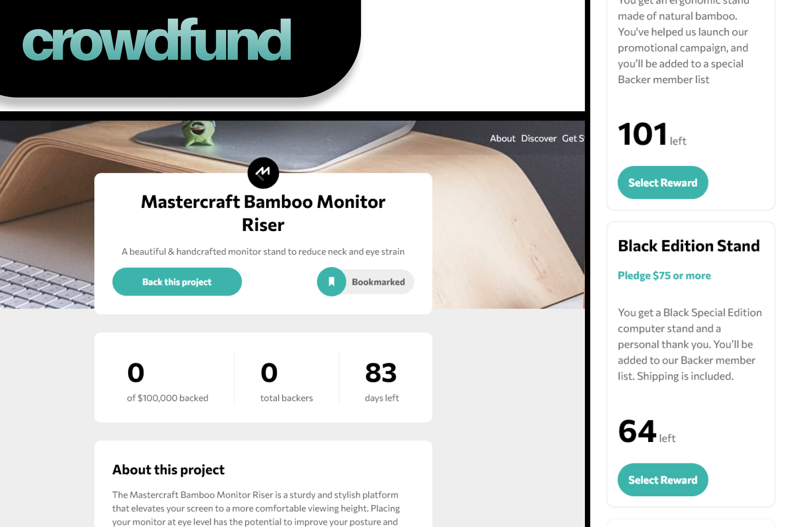

## Crowdfund dashboard - Vue

Front-end for a mockup crowdfunding site. Made with Vue.js (vanilla). Responsive, with modal windows, custom forms and state management. Design by FrontEndMentor.

[<i class="fab fa-github"></i> GitHub](https://github.com/migvidal/vidalwp) · [<i class="fas fa-globe"></i> Live website](https://crowdfunding-two.vercel.app/)

## Accordion FAQ

Responsive FAQ section with a complex image layout. Uses a customized _details_ semantic tag.

[<i class="fab fa-github"></i> GitHub](https://github.com/migvidal/faq-accordion-card-main) · [<i class="fas fa-globe"></i> Live website](https://migvidal.github.io/faq-accordion-card-main/)

## VidalWP

Simple and elegant WordPress theme. Styles in Bootstrap and Sass.

[<i class="fab fa-github"></i> GitHub](https://github.com/migvidal/vidalwp)

## Dimensional

A place to explore and upload 3d models. PHP based web app. Final project for my Web Development technical degree.

[<i class="fab fa-github"></i> GitHub](https://github.com/migvidal/dimensional)

🇪🇸 **[Ver en Español](/portfolio)**

**[&#8592; Go home](./)**