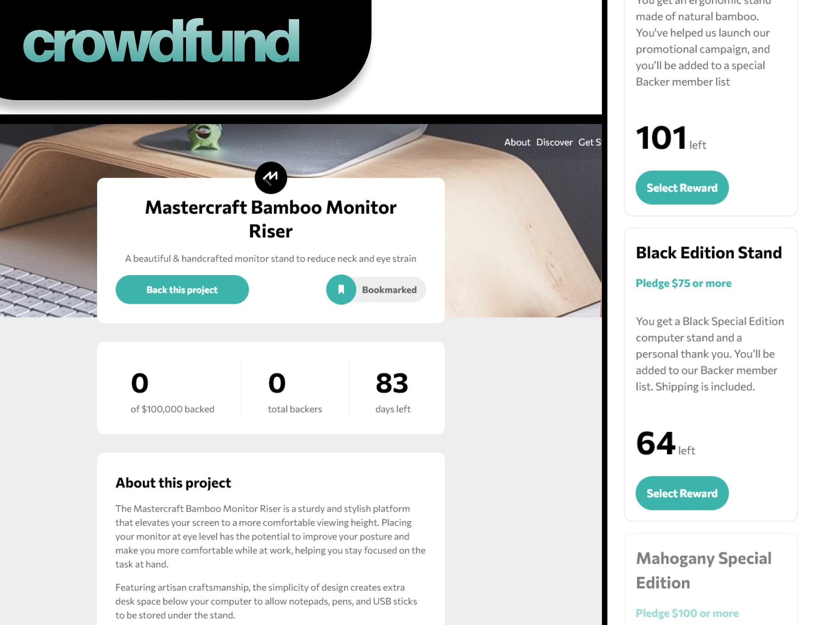
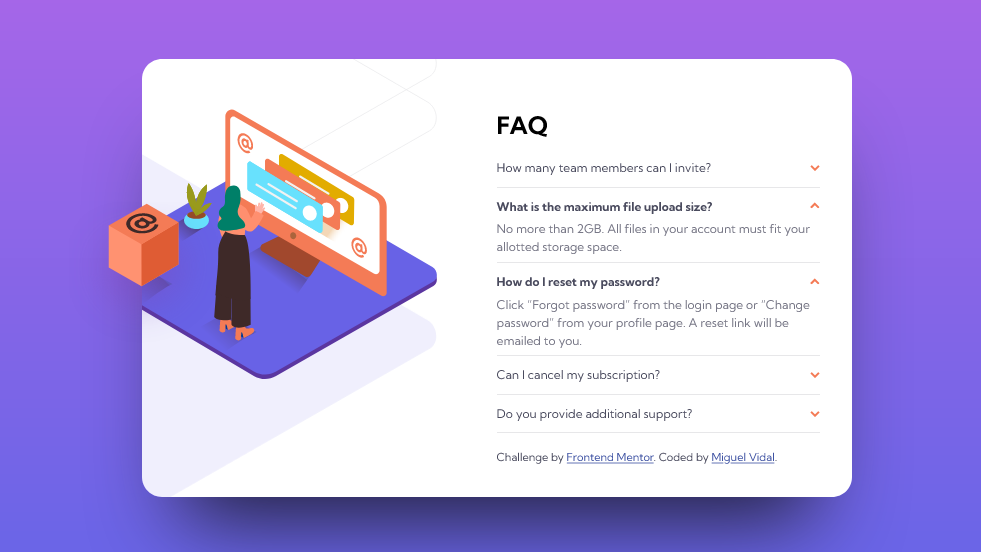

## Micro-chat - React + Firestore

App de chat con Firestore como back-end. Utiliza React con Firebase Hooks.

[<i class="fab fa-github"></i> GitHub](https://github.com/migvidal/migvidal-micro-chat) · [<i class="fas fa-globe"></i> Web en vivo](https://migvidal-micro-chat.vercel.app/)

## Crowdfund dashboard - Vue

Front-end para una web ficticia de _crowdfunding_. Realizado con Vue.js (vanilla). Responsive, con ventanas modales, formularios y gestión de estado. Diseñado por FrontEndMentor.

[<i class="fab fa-github"></i> GitHub](https://github.com/migvidal/crowdfunding-product-page) · [<i class="fas fa-globe"></i> Web en vivo](https://crowdfunding-two.vercel.app/)

## Acordeón FAQ

Sección de preguntas frecuentes responsive con una distribución compleja de imágenes y fondo. Utiliza la etiqueta semántica _details_ customizada.

[<i class="fab fa-github"></i> GitHub](https://github.com/migvidal/faq-accordion-card-main) · [<i class="fas fa-globe"></i> Web en vivo](https://migvidal.github.io/faq-accordion-card-main/)

## VidalWP

Tema WordPress básico y elegante. Estilos mediante Bootstrap y Sass.

[<i class="fab fa-github"></i> GitHub](https://github.com/migvidal/vidalwp)

## Dimensional

Galería online para explorar y subir modelos 3d. App web basada en PHP. Proyecto final para ciclo superior de Desarrollo Web.

[<i class="fab fa-github"></i> GitHub](https://github.com/migvidal/dimensional)

