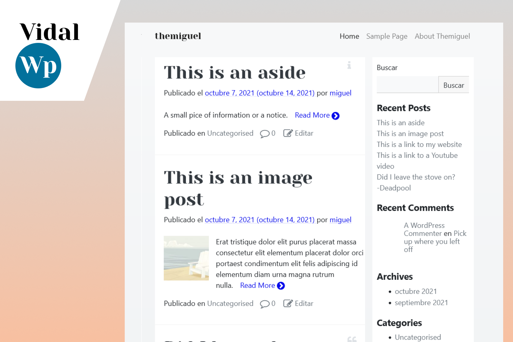

## Crowdfund dashboard - Vue

Front-end para una web ficticia de _crowdfunding_. Realizado con Vue.js (vanilla). Responsive, con ventanas modales, formularios y gestión de estado. Proyecto de FrontEndMentor.

[<i class="fab fa-github"></i> GitHub](https://github.com/migvidal/vidalwp) · [<i class="fas fa-globe"></i> Web en vivo](https://crowdfunding-two.vercel.app/)

## VidalWP

Tema WordPress básico y elegante. Estilos mediante Bootstrap y Sass.

[<i class="fab fa-github"></i> GitHub](https://github.com/migvidal/vidalwp)

## Dimensional

Galería online para explorar y subir modelos 3d. App web basada en PHP. Proyecto final para ciclo superior de Desarrollo Web.

[<i class="fab fa-github"></i> GitHub](https://github.com/migvidal/dimensional)

**[View in English](/portfolio-en)**

**[&#8592; Volver](./)**
